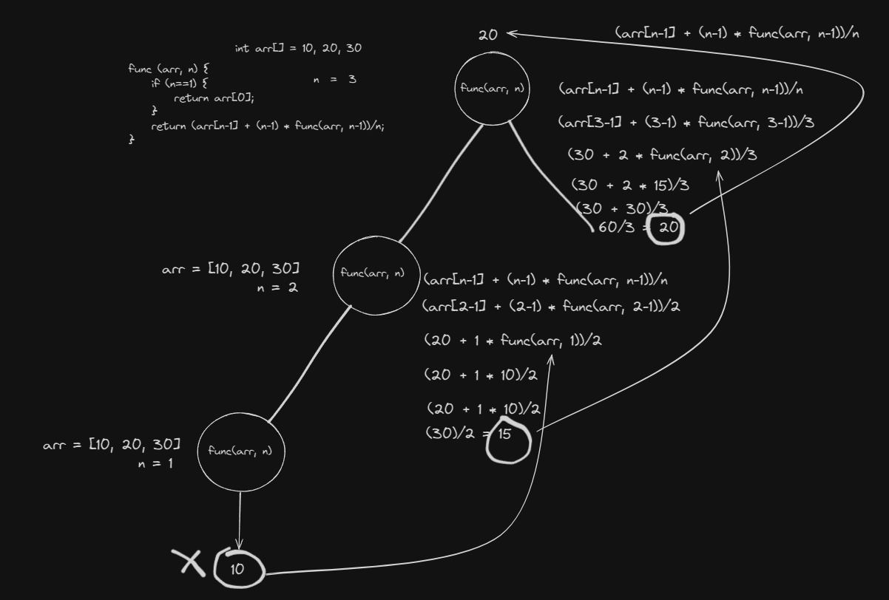

# Recursion

### Exercises (Using Recursion)

#### Get the max value of an array.
```c++
int findMax(int arr[], int n)
{
  if (n == 1)
  {
    return arr[0];
  }
  return (arr[n - 1] > findMax(arr, n - 1)) ? arr[n - 1] : findMax(arr, n - 1);
}
```
##### Tracing Tree
```c++
/*
findMax({1, 4, 5, 6, 7}, 5)
|
|--> findMax({1, 4, 5, 6}, 4)
|    |
|    |--> findMax({1, 4, 5}, 3)
|    |    |
|    |    |--> findMax({1, 4}, 2)
|    |    |    |
|    |    |    |--> findMax({1}, 1)
|    |    |    |    |
|    |    |    |    '--> return 1
|    |    |    |
|    |    |    '--> return max(4, 1) = 4
|    |    |
|    |    '--> return max(5, 4) = 5
|    |
|    '--> return max(6, 5) = 6
|
'--> return max(7, 6) = 7
*/
```

#### Get the average of an integer array.
```c++
double average_with_loop(int *arr, size_t n)
{
  int sum = 0;
  for (int i = 0; i < n; i++)
  {
    sum += arr[i];
  }
  return sum / n;
}

double average_with_recursion(int *arr, size_t n)
{
  // base case: if size of array is 0 return 0
  if (n == 1)
  {
    return arr[0];
  }

  return (arr[n - 1] + (n - 1) * average_with_recursion(arr, n - 1)) / n;
}
```


#### Write a function that computes the sum of an array.
```c++
// Returns sum of an array using for loop.
int sum_with_loop(int *arr, size_t n)
{
  int sum = 0;
  for (int i = 0; i < n; i++)
  {
    sum += arr[i];
  }
  return sum;
}

// Returns the sum of an array using recursion.
int sum_with_recursion(int *arr, size_t n)
{
  // base case, if size of array is 0 then return 0 as sum;
  if (n == 0)
  {
    return 0;
  }

  // recursive case, add the first element with the sum of remaining elements.
  return arr[0] + sum_with_recursion(arr + 1, n - 1);
}
```
